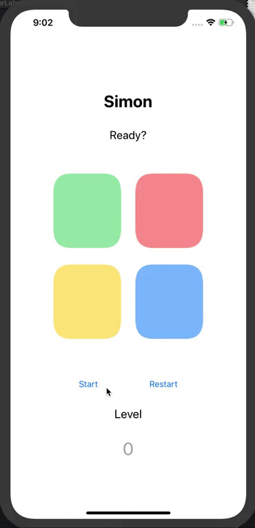

# Simon

Second app built using Swift 5 and Xcode 11. Simon is a simple but challenging memory game in which the computer signals the blocks in sequence and the user has to memorize the order and press the corresponding buttons in sequence. 

Through this project, I was able to apply what I learned with designing and implementing iOS apps, specifically, how to work with UIButton animations.

### Short demonstration of the app:

